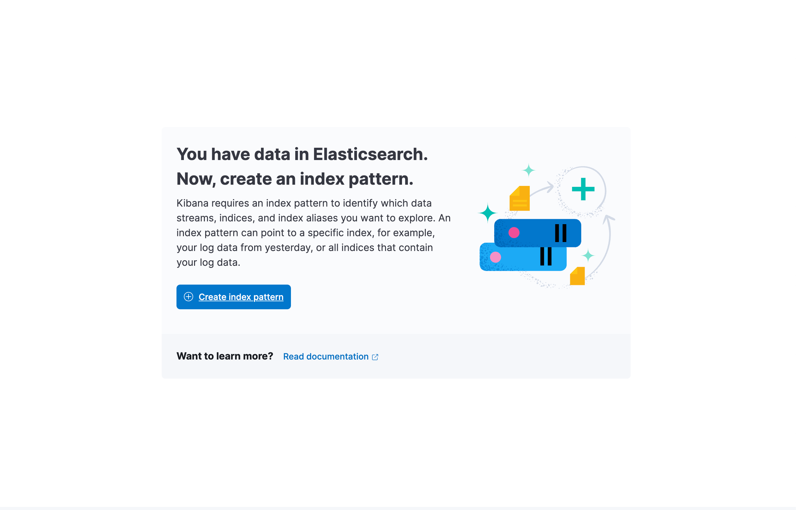
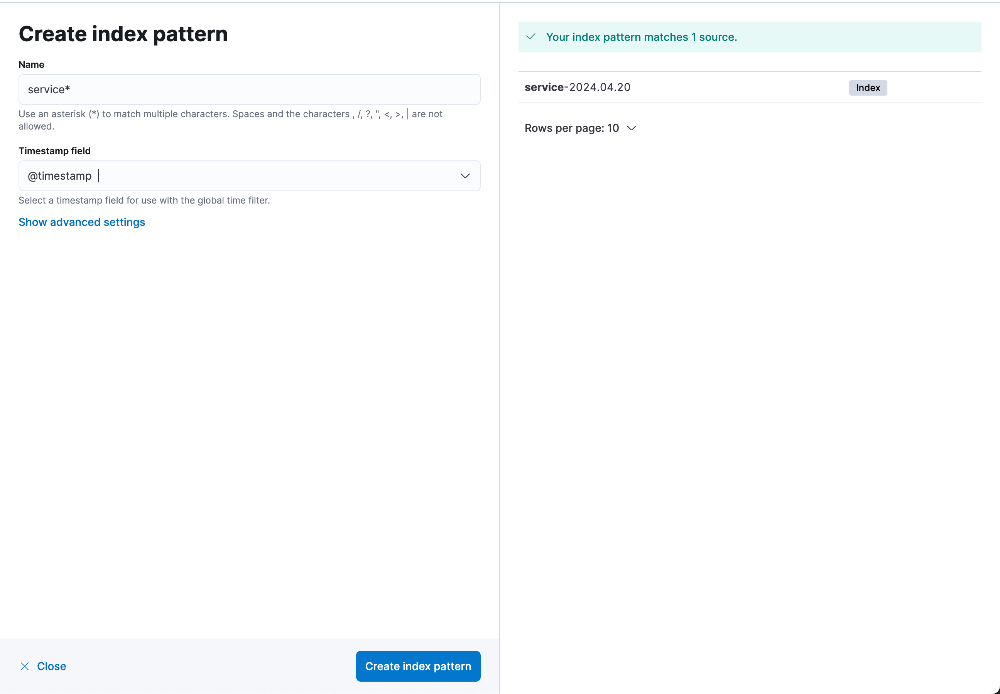
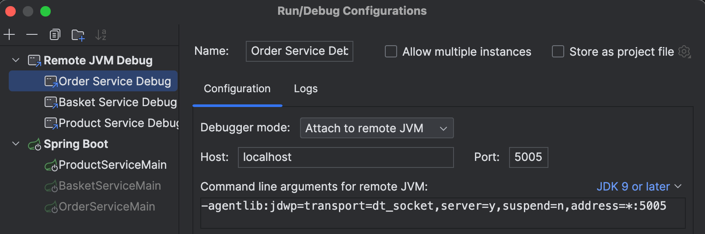
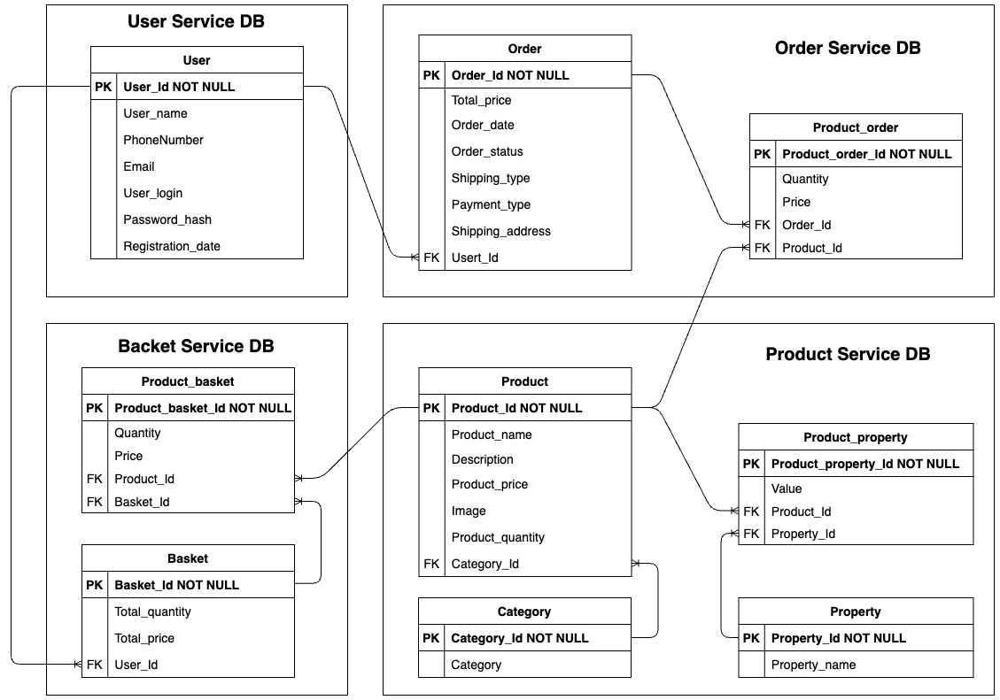
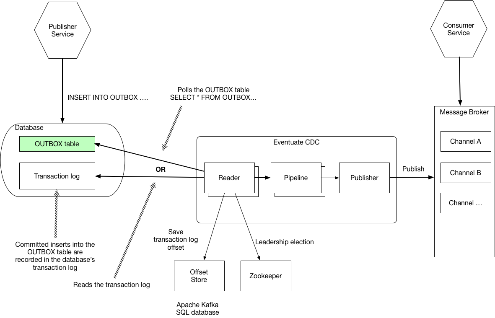

# Intro
This repository contains all materials related to the Master's thesis research on distributed transaction processing approaches based on the SAGA pattern.

## Project Structure

The project consists of three microservices: **Order Service**, **Basket Service**, and **Product Service**. Each service follows a modular structure:

- `${service-name}`: Main module containing the microservice logic.
- `${service-name}-api-messaging`: Module that includes domain events for the microservice.
- `${service-name}-api-web`: Module containing web request and response objects for the microservice.

## How to Launch the Project

To get the project up and running on your local machine, follow these steps:

1. Create an `.env` file in the root directory of your project. Copy the contents from `./.env.sample` and fill in your specific values.
2. Make sure Docker is installed on your local machine.
3. Build the microservices using the `./rebuild-and-run.sh` script. For subsequent runs without changes, simply execute `./run.sh`.
4. Access the Swagger UI to interact with the APIs at `http://localhost:${port}/swagger-ui/index.html` (replace `${port}` (by default `server.port=8081`) with the actual port number found in the `application.properties` of the respective microservice).
5. View logs of the services in Kibana at <http://localhost:5601/app/discover>

    **Note**: for the first Kibana access you need to create an index pattern:
    
    
6. To create first default basket, just run `POST /baskets` request in basket-service Swagger.
7. To fill DB with the default products, run `./scripts/insert-default-products.sql`

## Debugging

To configure remote JVM debugging in IntelliJ IDEA, create a Debug config as follows:

Check the `docker-compose.yml` file for required debugging ports:

`JAVA_TOOL_OPTIONS: -agentlib:jdwp=transport=dt_socket,server=y,suspend=n,address=*:5005`

## Architecture

Here is the diagram that represents data model of the whole system:

Here is the overview of the CDC service structure ([source](https://eventuate.io/docs/manual/eventuate-tram/latest/cdc-configuration.html)):

## Dev notes

1. Use `ua.nure.sagaresearch.common.util.LoggingUtils.log` wrapper for INFO logging purposes.
